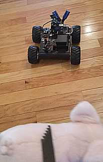
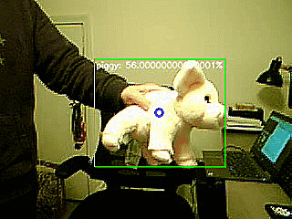
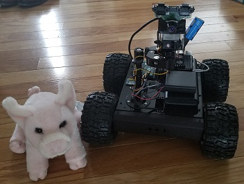
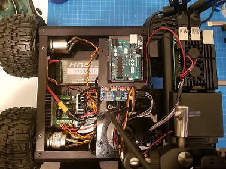
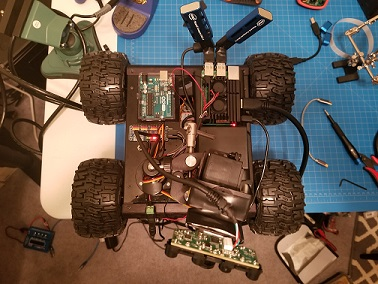
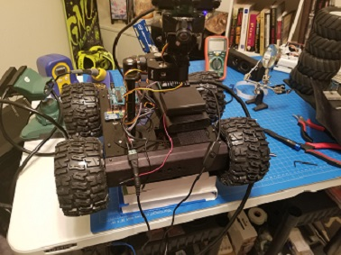

# :pig: Porky: The Real-Time Object Detecting Robot
The goal of this project is to demonstrate how to create a real-time object detection autonomous robot with relatively inexpensive components. By training your own machine learning model and pairing Intel's Neural Compute Stick 2 with a Raspberry Pi 3 B+, you'll be able jumpstart your next real-time object detection project! 





## Table of Contents
1. [Update History](#update-history)
2. [Project Overview](#project-overview)
3. [Reading This Guide](#reading-this-guide)
4. [Hardware List](#hardware-list)
    * [Required Hardware](#required-hardware)
    * [Optional Hardware](#optional-hardware)
5. [Software List](#software-list)
    * [Dev PC](#dev-pc)
    * [Raspberry Pi](#raspberry-pi)
6. [Hardware Configuration](#hardware-configuration)
    * [Image Capturing Setup](#image-capturing-setup)
    * [Tweak and Test Setup](#tweak-and-test-setup)
    * [Live Deployment Setup](#live-deployment-setup)
7. [Train Object Detection Model with TensorFlow](#train-object-detection-model-with-tensorflow)
8. [Optimize Model for Intel Neural Compute Stick 2](#optimize-model-for-intel-neural-compute-stick-2)
    * [Install OpenVINO on Dev PC](#install-openvino-on-dev-pc)
9. [Deploy the Optimized Model](#deploy-the-optimized-model)
    * [Install Raspberian on Raspberry Pi](#install-raspberian-on-raspberry-pi)
    * [Install OpenVINO on Raspberry Pi](#install-openvino-on-raspberry-pi)
    * [Clone this Repository to the Raspberry Pi](#clone-this-repository-to-the-raspberry-pi)
10. [Testing](#testing)
11. [Deploy the Robot](#deploy-the-robot)
12. [Feedback](#feedback)
13. [References and Acknowledgements](#references-and-acknowledgements)

## Update History
**2019/05/09:** Initial Release

## Project Overview
This project will guide you on how to: 
* Train your own model in TensorFlow using a transfer learning technique to save time and money 
* Optimize the resulting TensorFlow model so that it can be used with Intel's Inference Engine/Neural Compute Stick
* Implement the optimized model into a OpenCV/Python program
* Deploy the program with real-time performance and feedback loops

## Reading this Guide
The goal of this guide is to provide as many steps as possible in order to create an alike robot as this project's. However, not everyone will have an identical development environment as I do/did (a Dockerfile will be provided in the future to help alleviate this issue). This can be due to different hardware and/or software configurations.

As a result, please regard the following tips:
  * Refer to the links provided inline and the [References and Acknowledgements](#references-and-acknowledgements) for further explanations and examples.
  * When prompted with code/terminal examples that contain expressions that start with 'Path' and finish in [camel case](https://en.wikipedia.org/wiki/Camel_case) format, it's expected that you replace this expression with your own path.
  
  For example **PathToYourImageDirectory** and **PathToYourPictureLabel**:
  ```console
  pi@raspberrypi:~$ python3 image_capture.py -picture_directory=~/PathToYourImageDirectory -picture_label=PathToYourPictureLabel
  ```
  * Notice how the first section of the terminal example above provides the user information within the terminal: pi@raspberrypi:~$. This section is provided only as an example, your actual environment will probably differ.

## Hardware List
Please take note of 'Optional Hardware' list, this is provided only if you want to create a robot that is identical to the one this project demonstrates. This does not mean you are restricted to these components. Feel free to swap, subtract, and/or add components. However, for the best initial results (if your intention is to follow this guide), I highly suggest acquiring the components within the 'Required Hardware' section at the very least. This will enable you to train a customized machine learning model and perform real-time object detection with just a Raspberry Pi and the Intel Neural Compute Stick 2. My personal favorite sites for finding robotic components are [Adafruit](https://www.adafruit.com/), [RobotShop](https://www.robotshop.com/), [eBay](https://www.ebay.com/), and [Amazon](https://www.amazon.com/). The possibilities are endless! :thought_balloon: :sparkles:

### Required Hardware
* :computer: **Raspberry Pi 3 B+** w/ MicroSD Card and a way to power the device (battery or AC wall adapter)
* **[Intel Neural Compute Stick 2 (NCS2)](https://software.intel.com/en-us/neural-compute-stick/where-to-buy)**
* :video_camera: **USB or Pi Camera** This project uses the [PS3 Eye Camera](https://en.wikipedia.org/wiki/PlayStation_Eye) which can be found on eBay for about $6 USD each.

### Optional Hardware
**Disclaimer:** Feel free to swap out any of these parts.
* **Development PC (Linux, Windows, MacOS)** Development for this project was performed on a Windows 10 platform which this guide reflects. While it's recommended to utilize a dev PC (and to not develop directly on the Raspberry Pi) for sake of speed, it's not necessary. I also recommend utilizing Linux (Ubuntu 16.04) as much of the machine learning documentation out there is geared towards Linux. Future updates for this project will be performed within the Linux environment.
* **Display Monitor w/ HDMI Output** Helpful for debugging and testing within Raspberry Pi environment.
* **Robot Chassis Kit w/ Motors** This project uses the [Lynxmotion 4WD1 Rover Kit](http://www.lynxmotion.com/c-111-a4wd1-no-electronics.aspx). You can purchase this kit directly from [RobotShop](https://www.robotshop.com) or find a used kit on eBay.
* **Servos x2 w/ Mounting Hardware** This project uses the [Lynxmotion Pan and Tilt Kit](https://www.robotshop.com/en/lynxmotion-pan-and-tilt-kit-aluminium2.html).
* **PWM/Servo Controller** This project uses this [one](https://www.amazon.com/Channel-Driver-interface-PCA9685-arduino-Raspberry/dp/B01D9VNXEQ/ref=sr_1_fkmrnull_1?keywords=ficbox+pwm%2Fservo&qid=1556889116&s=gateway&sr=8-1-fkmrnull) from Amazon.
* **Motor Controller** This project uses the [Sabertooth 2X12 Regenerative Dual Channel Motor Controller](http://www.lynxmotion.com/p-562-sabertooth-2x12-regenerative-dual-channel-motor-controller.aspx) which can be found at [RobotShop](https://www.robotshop.com).
* **Li-Po Battery** To power the motor controller. This project uses an HRB 3S 11.1V 6000 mAh LiPo battery with an XT60 Plug. Search on Amazon or eBay for deals. **These batteries are known to cause fires, so please be aware of the risks and proper handling procedures.** 
* **Balance Charger/Discharger** To charge/discharge your Li-Po Battery safely. I use the [SKYRC iMAX B6 Mini](https://www.amazon.com/SKYRC-Professional-Balance-Discharger-Batteries/dp/B00YAASVGQ/ref=pd_sbs_21_5/144-5415705-1628207?_encoding=UTF8&pd_rd_i=B00YAASVGQ&pd_rd_r=cf5ae83e-6daa-11e9-8254-d7002cb5b05b&pd_rd_w=JfidM&pd_rd_wg=07fLG&pf_rd_p=588939de-d3f8-42f1-a3d8-d556eae5797d&pf_rd_r=HTGJGSAZSPKNNAG7NR62&psc=1&refRID=HTGJGSAZSPKNNAG7NR62). Note: this charger requires the charging unit itself and a wall adapter/power supply, ensure you're purchasing both.
* **Portable Powerbank** Be aware that not all portable chargers are compatible for Raspberry Pi projects (battery sleeping features). This project uses this [RAVPower Portable Charger](https://www.amazon.com/Portable-RAVPower-26800mAh-Double-Speed-Recharging/dp/B07793KSV4/ref=sr_1_3?keywords=ravpower+usb+c+portable+charger&qid=1556890740&s=industrial&sr=1-3-catcorr).
* **Mounting Arm** For holding the Pan and Tilt Kit, this project uses the [VideoSecu 1/4" Security Camera Mount](https://www.amazon.com/VideoSecu-Security-Adjustable-Universal-Mounting/dp/B000IDCDZY/ref=sr_1_fkmrnull_1?crid=15XODHE8DCCAT&keywords=videosecu+1%2F4%22+x+20+thread+swivel+security+camera+mount&qid=1556890057&s=gateway&sprefix=videosecu+1%2F4%22+x%2Caps%2C215&sr=8-1-fkmrnull) and the [SMALLRIG Super Clamp w/ 1/4" and 3/8" Thread](https://www.amazon.com/Smallrig-Thread-Cameras-Umbrellas-Shelves/dp/B0062U2M4E/ref=sr_1_fkmrnull_3?crid=1QMJ6ZJIAWL7&keywords=smallrig+super+clamp+w%2F1%2F4+and+3%2F8&qid=1556890140&s=electronics&sprefix=smallrig+super+clamp%2Caps%2C1424&sr=1-3-fkmrnull).
* **iFixit Toolkit** I use the [iFixit Pro Tech Toolkit](https://www.amazon.com/iFixit-Pro-Tech-Toolkit-Electronics/dp/B01GF0KV6G/ref=sr_1_2?keywords=ifixit&qid=1556889807&s=gateway&sr=8-2) (highly recommended if you do a lot of tinkering).
* **Velcro Tape (for modular prototype mounting)** I used a [2" Adhesive Black Hook and Loop Tape](https://www.amazon.com/Strenco-Adhesive-Black-Hook-Loop/dp/B00H3R9S1K/ref=sr_1_3?crid=2S3OQ9CVTVMCF&keywords=adhesive+black+hook+and+loop+tape&qid=1556890301&s=industrial&sprefix=adhesive+black+hook+an%2Celectronics%2C406&sr=1-3).
* **Assorted Electrical Components (switches, buttons, wires, breadboards, etc)** Check out [Adafruit](https://www.adafruit.com/) for great deals on electrical components.

## Software List
The following list can be determined on your own by following the [OpenVINO Toolkit documentation](https://docs.openvinotoolkit.org/).
### Dev PC
**Please visit the following link: [OpenVINO Windows Toolkit](https://software.intel.com/en-us/openvino-toolkit/choose-download) for installing OpenVINO on your platform.** 

The following bullet points reflect the requirements based on a Windows 10 environment:
* Python 3.6.5 with Python Libraries, 64-bit
* Microsoft Visual Studio with C++ 2019, 2017, or 2015 with MSBuild
* CMake 3.4+
* OpenCV 3.4+
* OpenVINO 2019.R1+
* TensorFlow
```powershell
PS C:\> pip install tensorflow
```

### Raspberry Pi
**Please visit the following link: [OpenVINO Toolkit for Raspberry Pi](https://docs.openvinotoolkit.org/latest/_docs_install_guides_installing_openvino_raspbian.html) for installing OpenVINO on your Raspberry Pi.**

The following bullet points reflect the basic requirements to
* Python 3.5+ (included with Raspberian Stretch OS)
* OpenVINO 2019.R1+
* Python Libraries (non-standard):
  * OpenCV 4.1+ (included with OpenVINO Toolkit)
  * [Adafruit ServoKit](https://circuitpython.readthedocs.io/projects/servokit/en/latest/)
  
  ```console
  pi@raspberrypi:~$ pip3 install adafruit-circuitpython-servokit
  ```
  
  * [pysabertooth](https://github.com/MomsFriendlyRobotCompany/pysabertooth)
  
  ```console
  pi@raspberrypi:~$ pip3 install pysabertooth
  ```
  
  * [pynput](https://pypi.org/project/pynput/) (for hardware testing and manual control)
  
  ```console
  pi@raspberrypi:~$ pip3 install pynput
  ```
 
## Hardware Configuration
The wiring diagrams contained within this section were created with [Fritzing](http://fritzing.org/home/), a great open-source tool.

### :camera: Image Capturing Setup
To train your own machine learning model, you will need to gather the data to train and validate/test your model on. The idea for this project was to train a model based on images captured with an identical camera that was eventually going to be deployed live.

This setup consists of:
* **Raspberry Pi 3 B+** w/ MicroSD Card
* **PS3 Eye USB Camera** TODO: provide a link to ebay search
* **Portable Powerbank** [RAVPower Portable Charger](https://www.amazon.com/Portable-RAVPower-26800mAh-Double-Speed-Recharging/dp/B07793KSV4/ref=sr_1_3?keywords=ravpower+usb+c+portable+charger&qid=1556890740&s=industrial&sr=1-3-catcorr)
* **Mini Button** [Tactile Button Switches from Adafruit](https://www.adafruit.com/product/367)
* **Breadboard** [Tiny Breadboard from Adafruit](https://www.adafruit.com/product/65)
* **USB C to MicroUSB Cable** To power the Raspberry Pi with the Powerbank. 
* **2 Female/Male Wires** [Female/Male 'Extension' Wires from Adafruit](https://www.adafruit.com/product/1954)

Wire Diagram of the Button setup for the Raspberry Pi:


**Note: the USB Camera and Powerbank are missing from the diagram above.**

Image of the configured setup:


Please see the [Capture Images with the Image Capturing Setup](#capture-images-with-the-capturing-setup) section to capture your own images for your dataset using this hardware configuration.

### :construction: Tweak and Test Setup
This hardware configuration serves the purpose for testing your hardware components (motors, servos, etc) and software integrations (debugging, testing, sandbox). This setup is geared towards using AC wall adapters to save batteries and keeping moving components as stationary as possible. Having a proper testing setup can potentially save lots of frustration and money. It is strongly suggested to test your own project before deploying it into the wild.

This setup consists of:
* **Raspberry Pi 3 B+** w/ MicroSD Card
* **[Intel Neural Compute Stick 2 (NCS2)](https://software.intel.com/en-us/neural-compute-stick/where-to-buy)**
* **PS3 Eye USB Camera** TODO: provide a link to ebay search Outer case has been removed to save weight and help with mounting.
* **Display Monitor w/ HDMI Output** Helpful for debugging and testing within Raspberry Pi environment.
* **HDMI Cable**
* **Robot Chassis Kit w/ Motors** This project uses the [Lynxmotion 4WD1 Rover Kit](http://www.lynxmotion.com/c-111-a4wd1-no-electronics.aspx). You can purchase this kit directly from [RobotShop](https://www.robotshop.com) or find a used kit on eBay.
* **Servos x2 w/ Mounting Hardware** This project uses the [Lynxmotion Pan and Tilt Kit](https://www.robotshop.com/en/lynxmotion-pan-and-tilt-kit-aluminium2.html).
* **PWM/Servo Controller** This project uses this [one](https://www.amazon.com/Channel-Driver-interface-PCA9685-arduino-Raspberry/dp/B01D9VNXEQ/ref=sr_1_fkmrnull_1?keywords=ficbox+pwm%2Fservo&qid=1556889116&s=gateway&sr=8-1-fkmrnull) from Amazon.
* **Mounting Arm** For holding the Pan and Tilt Kit, this project uses the [VideoSecu 1/4" Security Camera Mount](https://www.amazon.com/VideoSecu-Security-Adjustable-Universal-Mounting/dp/B000IDCDZY/ref=sr_1_fkmrnull_1?crid=15XODHE8DCCAT&keywords=videosecu+1%2F4%22+x+20+thread+swivel+security+camera+mount&qid=1556890057&s=gateway&sprefix=videosecu+1%2F4%22+x%2Caps%2C215&sr=8-1-fkmrnull) and the [SMALLRIG Super Clamp w/ 1/4" and 3/8" Thread](https://www.amazon.com/Smallrig-Thread-Cameras-Umbrellas-Shelves/dp/B0062U2M4E/ref=sr_1_fkmrnull_3?crid=1QMJ6ZJIAWL7&keywords=smallrig+super+clamp+w%2F1%2F4+and+3%2F8&qid=1556890140&s=electronics&sprefix=smallrig+super+clamp%2Caps%2C1424&sr=1-3-fkmrnull).
* **Motor Controller** This project uses the [Sabertooth 2X12 Regenerative Dual Channel Motor Controller](http://www.lynxmotion.com/p-562-sabertooth-2x12-regenerative-dual-channel-motor-controller.aspx) which can be found at [RobotShop](https://www.robotshop.com).
* **Li-Po Battery** To power the motor controller. This project uses a 3S 11.1V 6000 mAh LiPo battery with an XT60 Plug. Search on Amazon or eBay for deals. **These batteries are known to cause fires, so please be aware of the risks and proper handling procedures.**
* **Wiring Harness w/ Switch** To connect Motor Controller to Li-Po Battery. This project uses XT60 Plugs. This may come with your rover kit. If one doesn't, you'll need to pick [this](http://www.lynxmotion.com/p-497-wiring-harness-battery-connector.aspx) up or something similar and replace the installed plug with the appropriate plug type for your battery.
* **5V 2.5A Switching Power Supply w/ MicroUSB Connector** [Adafruit Link](https://www.adafruit.com/product/1995). To power Raspberry Pi directly.
* **5V 2A Power Supply w/ 2.1mm Jack** [Adafruit Link](https://www.adafruit.com/product/276). To power PWM/Servo Controller directly.
* **Female DC Power Adapter - 2.1mm Jack** [Adafruit Link](https://www.adafruit.com/product/368). To connect Power Supply to PWM/Servo Controller.
* **USB Adapters** TODO: add link. To mount the NCS2 sticks onto the Raspberry Pi. Process used: rotated the adapters into desired position and used hot glue to secure the positioning.

Robot top plate partially off to display the motor controller and Li-Po battery inside:



Top-view of the robot in the testing/tweaking setup:



Robot on top of books in the testing/tweaking setup to restrict base movement:



**Note: wire diagrams will be added in the future.**

### :rocket: Live Deployment Setup
After performing adequate hardware and software tests, you'll be ready to release your autonomous robot without its leash. This section will show you how to configure your robot to be deployed live.

This setup consists of:
* See [Tweak and Test Setup](#tweak-and-test-setup) for bulk of components (minus the wall power supplies and adapters).
* **Portable Powerbank** Be aware that not all portable chargers are compatible for Raspberry Pi projects. This project uses this [RAVPower Portable Charger](https://www.amazon.com/Portable-RAVPower-26800mAh-Double-Speed-Recharging/dp/B07793KSV4/ref=sr_1_3?keywords=ravpower+usb+c+portable+charger&qid=1556890740&s=industrial&sr=1-3-catcorr).
* **4 x AA Battery Holder /w On/Off Switch** [Adafruit Link](https://www.adafruit.com/product/830). To power the PWM/Servo Controller.
* **4 x AA Batteries**
* **USB Adapters** TODO: add link. To mount the NCS2 sticks onto the Raspberry Pi. Process used: rotated the adapters into desired position and used hot glue to secure the positioning.

TODO: Add pictures of 'live' environment..

**Note: wire diagrams will be added in the future.**

## Train Object Detection Model with TensorFlow
The goal of this section is to use TensorFlow to train your custom model using [transfer learning](https://en.wikipedia.org/wiki/Transfer_learning). While creating your own Machine Learning model from the ground up can be extremely rewarding, that process typically involves much more configuration, troubleshooting, and training/validating time... which can be a costly process. However, with transfer tearning, you can minimize all three fronts by choosing an already proven model to customize with your own dataset.

The following guides were used as reference for the machine learning sections:
* [TensorFlow Object Detector API Readme](https://github.com/tensorflow/models/tree/master/research/object_detection)
* [How to train your own Object Detector with TensorFlow’s Object Detector API](https://towardsdatascience.com/how-to-train-your-own-object-detector-with-tensorflows-object-detector-api-bec72ecfe1d9)
* [Creating your own object detector](https://towardsdatascience.com/creating-your-own-object-detector-ad69dda69c85)

Please read the above links to fill in missing gaps while this guide is updated and to get a deeper understanding of how to customize your dataset and use the TensorFlow framework for machine learning.

#### Create Your Dataset
First, you'll want to create your own dataset. You can do this by utilizing popular [public datasets](https://towardsdatascience.com/the-50-best-public-datasets-for-machine-learning-d80e9f030279) or by creating your own. I chose to create my own dataset for this project in an attempt to create a more unique classification. This process basically follows two steps: gather your data into a collection (with proper filenames to help organization, ie: piggy-1.png, piggy-2.png, etc) and label/annotate your data (label the regions of interest, ie: drawing a rectangle on the object you're classifying in the image and label it appropriately).


###### Capture Images with the [Image Capturing Setup](#image-capturing-setup)
This step isn't absolutely necessary to follow verbatim, you can also use images from a public dataset like [ImageNet](http://www.image-net.org/). Configure the hardware as described within the [Image Capturing Setup](#image-capturing-setup) and find the image_capture.py script within the utils folder.

1. Navigate to the utils directory:
```console
pi@raspberrypi:~$ cd ./Porky/utils
```

2. Run the image capturing Python script:
```console
pi@raspberrypi:~$ python3 image_capture.py -picture_directory=~/PathYourImageDirectory -picture_label=PathYourPictureLabel
```

3. Capture images by pointing the camera at a subject and pressing the mini-button (which is connected to the breadboard) to take the picture. The pictures will be saved within the directory that was specified and will automatically increment the image label based on the number of images already contained within the folder.

4. After you're satisfied with the amount of images you've taken, create two folders: /train and /test within your image directory and place about 80% of your total images within the /train directory and the remaining images within the /test directory. Click this [link](TODO: provide link) to find out why an 80/20 is a popular rule today for training and validating your datasets.

###### Label the Captured Images with LabelIMG
This process consists of labelling/annotating your images in a format readable by TensorFlow (this project utilizes the Pascal VOS format).

1. Install and launch LabelIMG. [Github Link](https://github.com/tzutalin/labelImg)
2. Click 'Change default saved annotation folder' in Menu -> File and choose the directory you want your 'train' annotations to be saved in.
3. Click 'Open Dir' and choose the directory that contains your 'train' images.
4. Click on an image to annotate.
5. Click 'Create RectBox'
6. Click and drag a rectangluar box over the portion of the image you want to classify and release the mouse button when you've outlined the region of interest.
7. A pop-up window will display that will prompt you to input a label for the region of interest that you outlined. Input the label and press the 'Ok' button or hit the 'Enter' key on your keyboard.
8. Repeat steps 4 through 7 until you've labelled all of the images within the directory.
9. Repeat steps 2 through 8 for the 'test' portion of your dataset.

#### Install the TensorFlow Framework onto Dev PC
Once you've gathered and labelled your dataset, your now ready to work with TensorFlow.

From PowerShell (if developing from a Windows PC) install TensorFlow to your Python Environment (virtual preferred - will be updated in the future):
```powershell
PS C:\> pip install tensorflow
```

Now install the TensorFlow models repository to your Dev PC:
```powershell
PS C:\> cd PathToPreferredDirectory
PS C:\> git clone https://github.com/tensorflow/models.git
```
The TensorFlow models repository will contain useful configuration scripts to configure your machine learning pipeline.

#### Convert the XML Annotations to CSV
See [Dat Tran's repository](https://github.com/datitran/raccoon_dataset/) for the xml_to_csv.py script utilized for this step. The modified version of this script is contained within the src/utils/ directory of this project's repository. See [Gilbert Tanner's article](https://towardsdatascience.com/creating-your-own-object-detector-ad69dda69c85) on how those modifications came to be.

After the modifications are made, use the following command:
```powershell
PS C:\> py xml_to_csv.py
```

This well create two CSV files: train_labels.csv and test_labels.csv.

#### Convert the Images and Annotations into TFRecord Format
This step requires two things to be done: your captured images need to be seperated into a two directories (train and test) and you'll need two corresponding csv files that contain your labels/annotations in Pascal VOC format.

First, modify the script, generate_tfrecord.py ([Dat Tran's repository](https://github.com/datitran/raccoon_dataset/)) to fit your labels. See the modified version of this script contained within the src/utils/ directory of this project's repository. After the script has been modified, run the following commands:

To convert your 'train' images and labels to TFRecord format:
```powershell
PS C:\> py generate_tfrecord.py --csv_input=PathToLabelsCSVFile\train_labels.csv --image_dir=PathToImageDirectory\train --output_path=train.record
```

To convert your 'test' images and labels to TFRecord format:
```powershell
PS C:\> py generate_tfrecord.py --csv_input=PathToLabelsCSVFiles\test_labels.csv --image_dir=PathToImageDirectory\test --output_path=test.record
```

#### Pick an Already Trained Model and Use Transfer Learning
To save some cost and time, you can pick out an already trained machine learning model to use for your customized dataset. The following two bullet points will help you in the process of choosing an appropriate model:
* [TensorFlow Object Detection Model Zoo](https://github.com/tensorflow/models/blob/master/research/object_detection/g3doc/detection_model_zoo.md)
* [List of Supported Models for the MYRIAD (NCS2) Plugin](https://docs.openvinotoolkit.org/latest/_docs_IE_DG_supported_plugins_MYRIAD.html)

This project uses the [ssd_mobilenet_v2_coco](http://download.tensorflow.org/models/object_detection/ssd_mobilenet_v2_coco_2018_03_29.tar.gz) model. It's not listed as an officially supported Myriad model (which I learned after the fact), but I was lucky in the case that it actually worked for my use case.

#### Deploy the TensorFlow Training Session
If you have access to a capable GPU, I suggest performing Machine Learning locally. However, if you're like me and don't have immediate access to a capable GPU, you can use a cloud compute service to perform your Machine Learning for you. For this project, I used the Google Cloud Platform to perform the TensorFlow training.

##### Using the Google Cloud Platform for Machine Learning
Please follow the following [link](https://github.com/tensorflow/models/blob/master/research/object_detection/g3doc/running_on_cloud.md) to guide you through this process. Be aware that there are frustrations dealing with depcrecated functions and bash commands within the Windows platform. In a future update, I will thoroughly detail the process I used via Windows 10 in this guide. In the meantime, feel free to provide some feedback on any issues you incur and I will attempt to help you as best as I can.

Another useful guide from TensorFlow: [Quick Start: Distributed Training on the Oxford-IIIT Pets Dataset on Google Cloud](https://github.com/tensorflow/models/blob/master/research/object_detection/g3doc/running_pets.md) 

#### Extract the Latest Checkpoints
Once you're satisified with accurracy of your machine learning session, you can kill the TensorFlow process and extract the latest checkpoints for your trained model. If you used the Google Cloud Platform, the checkpoint files will be contained within your storage bucket.

[A checkpoint will typically consist of three files](https://github.com/tensorflow/models/blob/master/research/object_detection/g3doc/exporting_models.md):
* model.ckpt-${CHECKPOINT_NUMBER}.data-00000-of-00001
* model.ckpt-${CHECKPOINT_NUMBER}.index
* model.ckpt-${CHECKPOINT_NUMBER}.meta

## Optimize Model for Intel Neural Compute Stick 2
After training the machine learning model with TensorFlow, you're now ready to prepare the model and convert it to an Intermediate Representation (IR). This will allow the model to be utilized with the MYRIAD Plugin (Intel NCS2) and therefore be deployed live with a combination of a Raspberry Pi 3 B+ and an Intel Neural Compute Stick. 

Please read the following guides as a precursor to the next steps:
* [TensorFlow Guide on Exporting Models](https://github.com/tensorflow/models/blob/master/research/object_detection/g3doc/exporting_models.md)
* [OpenVINO Guide for Converting TensorFlow Models to Intermediate Representation]( https://docs.openvinotoolkit.org/latest/_docs_MO_DG_prepare_model_convert_model_Convert_Model_From_TensorFlow.html)

#### Export TensorFlow Model Checkpoint(s) into a Frozen Inference Graph

1. Copy the [latest checkpoints](#extract-the-latest-checkpoints) to the cloned TensorFlow models\research directory
2. Execute the following command within PowerShell:
```powershell
PS C:\models\research> py .\object_detection\export_inference_graph.py `
>> --input_type image_tensor `
>> --pipeline_config_path C:\PathToYourPipelineConfigFile
>> --trained_checkpoint_prefis model.ckpt-PREFIXNUMBER `
>> --output_directory PathToOutputDirectory
```
This command will output multiple files to your specified output directory, we will be using the frozen_inference_graph.pb file for our next step.

#### Install OpenVINO on Dev PC
If you haven't done so already, [install OpenVINO](https://software.intel.com/en-us/openvino-toolkit/) on your Dev PC.

#### Convert the Frozen TensorFlow Graph to Optimized IR
Navigate to the installed Intel OpenVINO directory and execute the following command within PowerShell:
```powershell
PS C:\Intel\computer_vision_sdk_2018.5.456\deployment_tools\model_optimizer> py .\mo_tf.py `
>> --input_model C:\PathToYourFrozenTFModel\frozen_inference_graph.pb `
>> --tensorflow_use_custom_operations_config C:\Intel\computer_vision_sdk_2018.5.456\deployment_tools\model_optimizer\extensions\front\tf\ssd_v2_support.json `
>> --tensorflow_object_detection_api_pipeline_config C:\PathToYourPipelineConfigFile
>> --data_type FP16
```
Take note of the line: --data_type FP16, the Myriad VPU (Neural Compute Stick) only supports 16-bit precision. If the line is left out, the converted model will not work with your compute stick(s).

TODO: add outputted file names and descriptions

## Deploy the Optimized Model

#### Install Raspberian on Raspberry Pi
If you're unfamiliar with the Raspberry Pi platform, follow [this official guide](https://projects.raspberrypi.org/en/projects/raspberry-pi-setting-up) to set your Pi up. Be sure to download Raspberian for your OS.

#### Install OpenVINO on Raspberry Pi
The next step is to install OpenVINO on your Raspberry Pi, please follow [this guide](https://docs.openvinotoolkit.org/latest/_docs_install_guides_installing_openvino_raspbian.html) to do so.

You should see the following message within your Raspberry Pi terminal:

TODO: insert picture of setupvars.sh being executed.

#### Clone this Repository to the Raspberry Pi
Connect to your Raspberry Pi (via SSH, RealVNC, or locally) and navigate to your preferred directory to store projects in. Then perform a git clone within the terminal:

```console
pi@raspberrypi:~$ git clone https://github.com/keith-E/Porky.git
```

## Testing
During the lifecycle of your robot project, it's a good idea to develop and maintain some sort of testing strategy. In this section, I will break down how to use the provided testing scripts and their purpose.

#### Hardware Specific Tests
###### Test the Camera
###### Test the Motors
###### Test the Servos

#### Unit Tests
###### Test the ML Model
###### Test the Camera Process
###### Test the Detection Process

#### Integration Tests
###### Test Detection with Pan and Tilt
###### Test Detection with Pan and Follow

## Deploy the Robot

## Feedback
I tried my best to detail all of the processes I used to get this project off the ground, but I may have missed some key steps along the way or you may have experienced some frustrations trying to follow along. With that being said, please don't hesitate to drop me any comments, questions or concerns. I promise to do my best to address your issues.

## References and Acknowledgements
**[leswright1977/Rpi3_NCS2](https://github.com/leswright1977/RPi3_NCS2):** leswright1977's bottle-chasing robot introduced me to the Intel NCS2 and its ability to integrate machine learning models for real-time applications.

**[PINTO0309](https://github.com/PINTO0309):** PINTO0309's [MobileNet-SSD-RealSense](https://github.com/PINTO0309/MobileNet-SSD-RealSense) project introduced me to using multiprocessing with OpenCV and Intel's CNN backend in order to achieve faster results.

**[Fritzing - An Open Source Diagram Design Tool](http://fritzing.org/home/)**

**[TensorFlow Object Detector API Readme](https://github.com/tensorflow/models/tree/master/research/object_detection)**

**[How to train your own Object Detector with TensorFlow’s Object Detector API:](https://towardsdatascience.com/how-to-train-your-own-object-detector-with-tensorflows-object-detector-api-bec72ecfe1d9)** This article was great for providing a great easy-to-follow reference for creating the dataset(s) for this project. The xml_to_csv.py and generate_tf_record.py scripts were also utilized from the author's [github repository](https://github.com/datitran/raccoon_dataset)

**[Creating your own object detector:](https://towardsdatascience.com/creating-your-own-object-detector-ad69dda69c85)** This article provided a good reference and filled some blanks for preparing a dataset to be utilized for TensorFlow training. With a combination of the official TensorFlow documentation (Object Detector API Readme), Dat Tran's article (provided above), and this article, I was able to successfully train a customized machine learning model with TensorFlow and transfer learning.

**[Running TensorFlow on the Cloud](https://github.com/tensorflow/models/blob/master/research/object_detection/g3doc/running_on_cloud.md)**

**[OpenCV Docs](https://docs.opencv.org/):** The official documentation for OpenCV. Necessary for gaining a strong foundation of using OpenCV to build your application.

**[Adafruit Pixy Pet Robot](https://learn.adafruit.com/pixy-pet-robot-color-vision-follower-using-pixycam/overview):** Adafruit's guide on creating color vision following robot using a Pixy CMUCam-5 vision system and Zumo robot platform. This guide was very helpful for learning how to integrate a PID (Proportional-Integral-Deravitive) control feedback loop for the motion mechanisms.

**[PyimageSearch](https://www.pyimagesearch.com/)** Adrian provides great tutorials that are in-depth and easy to follow. This website is a great resource to learn about applying computer vision to your next project.
